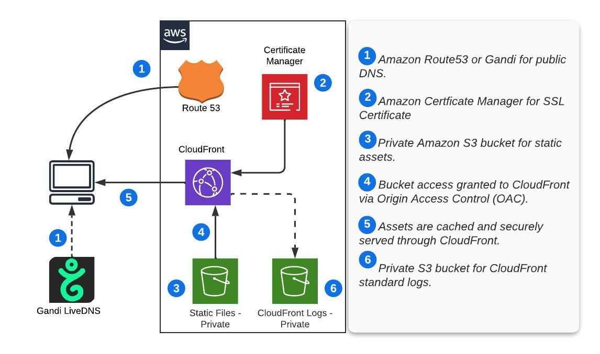

# terraform-aws-static-web
A Terraform Module to configure a static website using Amazon AWS Services

With support for using [Gandi](https://www.gandi.net) LiveDNS instead of Route53

## Components

| Function            | Service                                                                                                |
|---------------------|--------------------------------------------------------------------------------------------------------|
| Static File hosting | [S3](https://aws.amazon.com/s3/)                                                                       |
| Certificate         | [ACM](https://aws.amazon.com/certificate-manager/)                                                     |
| DNS                 | [Route 53](https://aws.amazon.com/route53/) or [Gandi LiveDNS](https://www.gandi.net/en-US/domain/dns) |
| CDN                 | [Cloudfront](https://aws.amazon.com/cloudfront/)                                                                                         |

<!-- TOC -->
* [terraform-aws-static-web](#terraform-aws-static-web)
  * [Components](#components)
  * [Prerequisites](#prerequisites)
  * [Cost Example](#cost-example)
      * [Assumptions](#assumptions)
    * [AWS](#aws)
    * [Gandi](#gandi)
  * [Examples](#examples)
  * [Requirements](#requirements)
  * [Providers](#providers)
  * [Resources](#resources)
  * [Inputs](#inputs)
  * [Outputs](#outputs)
<!-- TOC -->

## Prerequisites
* AWS Account
* Route53 Zone - *If using Route53*
* Gandi Account - *If using Gandi LiveDNS*

## Cost Example
You should use the [AWS Pricing Calculator](https://calculator.aws/) to best determine your costs.
The estimates are an example only and do not take into account any other infrastructure you may run.

The cost is lower if your deployment is covered under the [AWS Free Tier](https://aws.amazon.com/free/)

#### Assumptions
* 1 S3 bucket with 500 MB of data
  * 250 PUT, COPY, POST, LIST requests / mo
  * 10,000 SELECT, GET requests / mo
  * Outbound data to Cloudfront is free
* 1 x Cloudfront Distribution
  * 10 GB /mo of outbound data transfer to the internet
  * 25,000 HTTPS requests /mo
* 1 x either AWS Route 53 Hosted Zone or a Gandi Domain w/ LiveDNS
  * w/ Route 53, 25,000 standard queries / mo
  * w/ Gandi, unlimited /mo

### AWS
| Service      | Cost / Mo | Covered Under Free Tier / mo |
|--------------|-----------|------------------------------|
| Route 53     | $0.51     | $0.51                        |
| S3           | $0.02     | $0.02                        |
| CloudFront   | $0.88     | $0.03                        |
| **Total**    | **$1.41** | **$0.56**                    |

### Gandi

| Service       | Cost / Mo | Covered Under Free Tier / mo |
|---------------|-----------|------------------------------|
| Gandi LiveDNS | $0.00     | $0.00                        |
| S3            | $0.02     | $0.02                        |
| CloudFront    | $0.88     | $0.03                        |
| **Total**     | **$0.90** | **$0.05**                    |

## Examples
* [AWS Only Example](./examples/aws-only)
* [Gandi LiveDNS Example](./examples/gandi-livedns)

<!-- BEGIN_TF_DOCS -->
## Requirements

| Name | Version |
|------|---------|
|  [terraform](#requirement\_terraform) | >= 1.4.6, < 2.0.0 |
|  [aws](#requirement\_aws) | ~> 5.7.0 |
|  [gandi](#requirement\_gandi) | = 2.2.3 |
|  [random](#requirement\_random) | 3.5.1 |

## Providers

| Name | Version |
|------|---------|
|  [aws](#provider\_aws) | 5.7.0 |
|  [aws.use1](#provider\_aws.use1) | 5.7.0 |
|  [gandi](#provider\_gandi) | 2.2.3 |
|  [random](#provider\_random) | 3.5.1 |

## Resources

| Name | Type |
|------|------|
| [aws_acm_certificate.site](https://registry.terraform.io/providers/hashicorp/aws/latest/docs/resources/acm_certificate) | resource |
| [aws_acm_certificate_validation.site-aws](https://registry.terraform.io/providers/hashicorp/aws/latest/docs/resources/acm_certificate_validation) | resource |
| [aws_acm_certificate_validation.site-gandi](https://registry.terraform.io/providers/hashicorp/aws/latest/docs/resources/acm_certificate_validation) | resource |
| [aws_cloudfront_distribution.site](https://registry.terraform.io/providers/hashicorp/aws/latest/docs/resources/cloudfront_distribution) | resource |
| [aws_cloudfront_origin_access_control.site](https://registry.terraform.io/providers/hashicorp/aws/latest/docs/resources/cloudfront_origin_access_control) | resource |
| [aws_route53_record.site](https://registry.terraform.io/providers/hashicorp/aws/latest/docs/resources/route53_record) | resource |
| [aws_route53_record.site-validation](https://registry.terraform.io/providers/hashicorp/aws/latest/docs/resources/route53_record) | resource |
| [aws_s3_bucket.site](https://registry.terraform.io/providers/hashicorp/aws/latest/docs/resources/s3_bucket) | resource |
| [aws_s3_bucket_policy.site](https://registry.terraform.io/providers/hashicorp/aws/latest/docs/resources/s3_bucket_policy) | resource |
| [aws_s3_bucket_versioning.site](https://registry.terraform.io/providers/hashicorp/aws/latest/docs/resources/s3_bucket_versioning) | resource |
| [gandi_livedns_record.site](https://registry.terraform.io/providers/go-gandi/gandi/2.2.3/docs/resources/livedns_record) | resource |
| [gandi_livedns_record.site-validation](https://registry.terraform.io/providers/go-gandi/gandi/2.2.3/docs/resources/livedns_record) | resource |
| [random_string.referer](https://registry.terraform.io/providers/hashicorp/random/3.5.1/docs/resources/string) | resource |
| [aws_iam_policy_document.cloudfront_readonly](https://registry.terraform.io/providers/hashicorp/aws/latest/docs/data-sources/iam_policy_document) | data source |

## Inputs

| Name | Description | Type | Default | Required |
|------|-------------|------|---------|:--------:|
|  [website\_hostname](#input\_website\_hostname) | Fully qualified domain name for website - www.yourdomain.com | `string` | n/a | yes |
|  [bucket\_versioning](#input\_bucket\_versioning) | S3 Bucket Versioning? | `bool` | `false` | no |
|  [cloudfront\_cache\_allowed\_methods](#input\_cloudfront\_cache\_allowed\_methods) | CloudFront Allowed Cache Methods - Controls which HTTP methods CloudFront processes and forwards to your Amazon S3 bucket or your custom origin. | `list(string)` | <pre>[   "GET",   "HEAD" ]</pre> | no |
|  [cloudfront\_cached\_methods](#input\_cloudfront\_cached\_methods) | CloudFront Cached Methods - Controls whether CloudFront caches the response to requests using the specified HTTP methods. | `list(string)` | <pre>[   "GET",   "HEAD" ]</pre> | no |
|  [cloudfront\_default\_ttl](#input\_cloudfront\_default\_ttl) | CloudFront Default TTL -  Default amount of time (in seconds) that an object is in a CloudFront cache before CloudFront forwards another request in the absence of an Cache-Control max-age or Expires header. | `number` | `3600` | no |
|  [cloudfront\_geo\_locations](#input\_cloudfront\_geo\_locations) | n/a | `list(string)` | `[]` | no |
|  [cloudfront\_geo\_restriction\_type](#input\_cloudfront\_geo\_restriction\_type) | n/a | `string` | `"none"` | no |
|  [cloudfront\_max\_ttl](#input\_cloudfront\_max\_ttl) | CloudFront Maximum TTL | `number` | `86400` | no |
|  [cloudfront\_min\_ttl](#input\_cloudfront\_min\_ttl) | CloudFront Minimum TTL | `number` | `0` | no |
|  [cloudfront\_price\_class](#input\_cloudfront\_price\_class) | CloudFront edge locations are grouped into geographic regions, and we’ve grouped regions into price classes | `string` | `"PriceClass_100"` | no |
|  [cloudfront\_viewer\_security\_policy](#input\_cloudfront\_viewer\_security\_policy) | Which Security Policy to use. Consult this table: https://docs.aws.amazon.com/AmazonCloudFront/latest/DeveloperGuide/secure-connections-supported-viewer-protocols-ciphers.html | `string` | `"TLSv1.2_2021"` | no |
|  [cloudfront\_viewer\_ssl\_support\_method](#input\_cloudfront\_viewer\_ssl\_support\_method) | Which SSL support method to use. "sni-only" or "vip" supporte"sni-only" or "vip" supported | `string` | `"sni-only"` | no |
|  [dns\_type](#input\_dns\_type) | Either "aws" or "gandi" depending on your DNS set up | `string` | `"aws"` | no |
|  [force\_destroy\_bucket](#input\_force\_destroy\_bucket) | Force Destroy S3 Bucket? | `bool` | `false` | no |
|  [gandi\_key](#input\_gandi\_key) | Gandi API Key | `string` | `""` | no |
|  [gandi\_sharing\_id](#input\_gandi\_sharing\_id) | Gandi API Sharing ID | `string` | `""` | no |
|  [region](#input\_region) | AWS Region | `string` | `"us-west-2"` | no |
|  [route53\_zone\_id](#input\_route53\_zone\_id) | Route 53 Zone ID for website TLD | `string` | `""` | no |

## Outputs

| Name | Description |
|------|-------------|
|  [bucket-hosted-zone-id](#output\_bucket-hosted-zone-id) | Static file Bucket Zone ID |
|  [bucket-id](#output\_bucket-id) | Static file S3 Bucket ID |
|  [bucket-region](#output\_bucket-region) | Static file S3 Bucket Region |
|  [bucket-versioning](#output\_bucket-versioning) | Static file Bucket Versioning |
|  [certificate-validation-domain-name](#output\_certificate-validation-domain-name) | Certificate Validation, validation record FQDNs |
|  [cloudfront-distribution-domain-name](#output\_cloudfront-distribution-domain-name) | Cloudfront Distribution Domain Name |
|  [cloudfront-distribution-http-last-modified-time](#output\_cloudfront-distribution-http-last-modified-time) | Cloudfront Distribution Last Modified |
|  [cloudfront-distribution-http-version](#output\_cloudfront-distribution-http-version) | Cloudfront Distribution HTTP Version |
|  [cloudfront-distribution-id](#output\_cloudfront-distribution-id) | Cloudfront Distribution ID |
|  [cloudfront-distribution-status](#output\_cloudfront-distribution-status) | Cloudfront Distribution Status |
|  [cloudfront-distribution-zone-id](#output\_cloudfront-distribution-zone-id) | Cloudfront Distribution Zone ID |
|  [cloudfront-origin-access-control-id](#output\_cloudfront-origin-access-control-id) | Cloudfront Origin Access Control |
|  [dns-site-alias](#output\_dns-site-alias) | DNS Site Alias |
|  [dns-site-id](#output\_dns-site-id) | DNS Site ID |
|  [dns-site-name](#output\_dns-site-name) | DNS Site Name |
|  [gandi-domain](#output\_gandi-domain) | Are we a Gandi Domain Boolean |
|  [s3\_bucket\_policy](#output\_s3\_bucket\_policy) | Cloudfront Origin Access Control |
|  [site-certificate-arn](#output\_site-certificate-arn) | Site Certificate ARN |
|  [site-certificate-domain-name](#output\_site-certificate-domain-name) | Site Certificate domain name |
|  [site-certificate-domain-validation-options](#output\_site-certificate-domain-validation-options) | Site Certificate Domain Validation Options |
|  [site-certificate-expiration](#output\_site-certificate-expiration) | Site Certificate Expiration |
|  [site-certificate-issued](#output\_site-certificate-issued) | Site Certificate Issued |
|  [site-certificate-status](#output\_site-certificate-status) | Site Certificate provisioning status |
<!-- END_TF_DOCS -->
